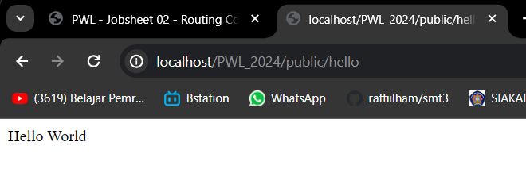
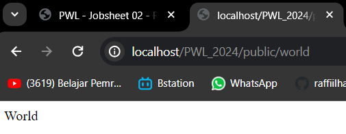
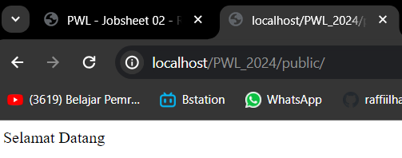
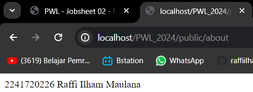
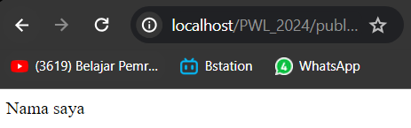
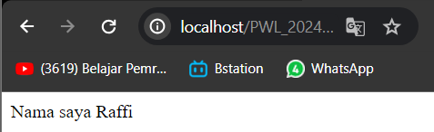
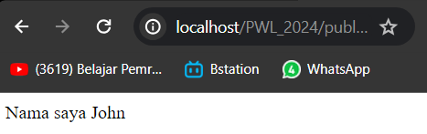

## LAPORAN JOBSHEET 2
## ROUTE, CONTROLLER ,DAN VIEW

#

Raffi Ilham Maulana
(22) / TI-2F

#

## 2.Routing
## Basic Routing

1. Routing Hello World   
2. Routing World  
3. Routing Selamat Datang  
4. Routing About  

## Route Parameters

b. Routing /user/{name} karena nilai "NamaAnda" diberikan sebagai nilai parameter {name} dalam URL  
c. tidak muncul output/ halaman kosong dikarenakan tidak menyertakan nilai untuk parameter {name}   
e.   
f.   

## Optional Parameters

b.    
c.    
e.    

## 3.Controller
## Membuat Controller

e    

